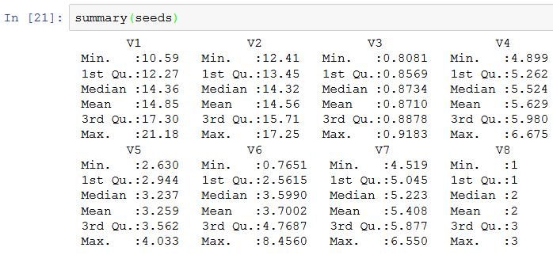
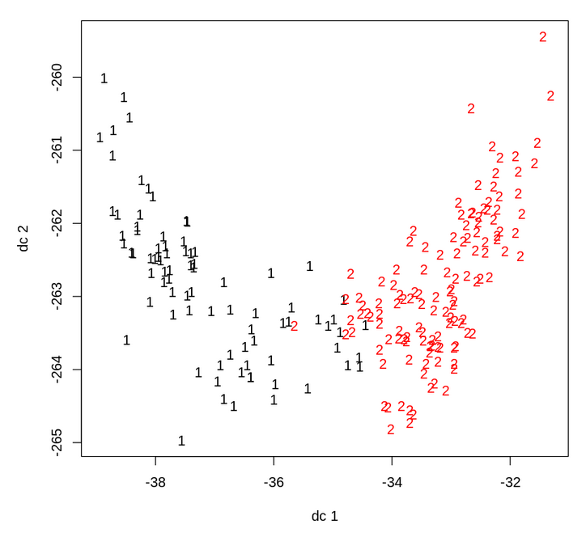
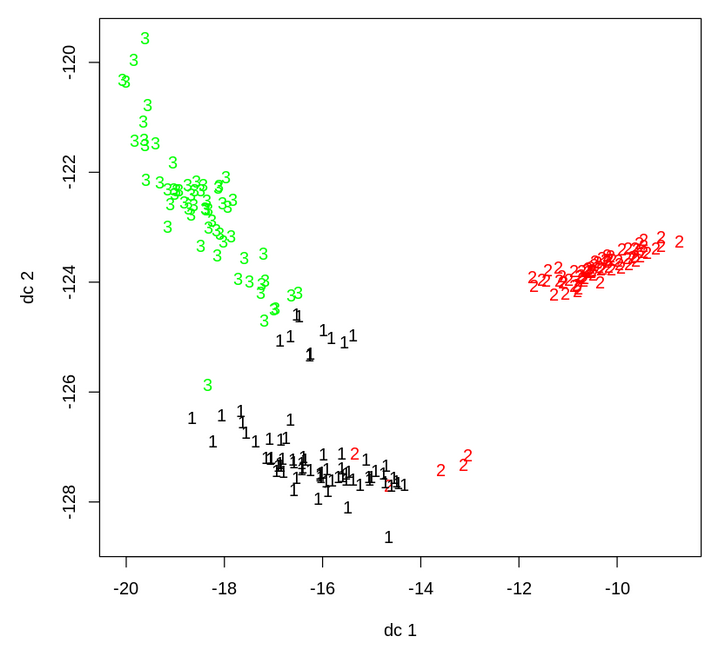
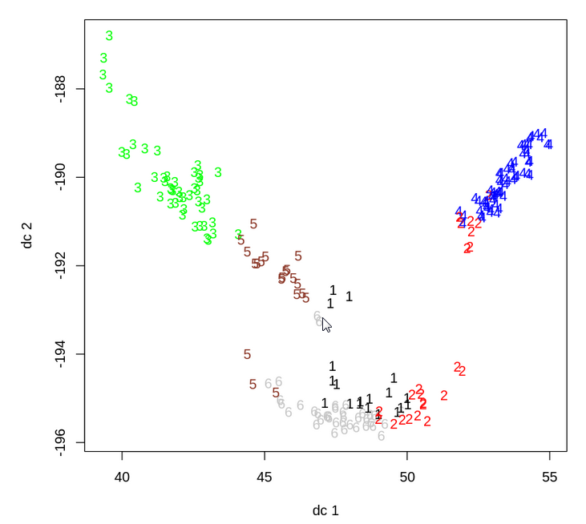
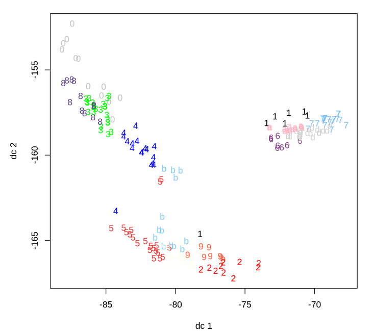
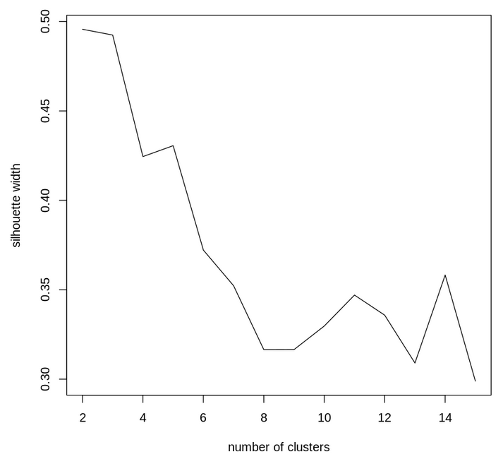

# CSX_450_1_Project_2

Table of contents
=================
  
  * [Seeds](#seeds)
  * [Plants](#plants)

Seeds
=====

## Domain

<<<<<<< HEAD
This problem uses measurements of geometrical properties of kernels belonging to three different varieties of wheat. As described in the paper "Complete Gradient Clustering Algorithm for Features Analysis of X-Ray Images" by Małgorzata CharytanowiczJerzy NiewczasPiotr KulczyckiPiotr A. KowalskiSzymon ŁukasikSławomir Żak, published in  Advances in Intelligent and Soft Computing ([paper](https://link.springer.com/chapter/10.1007/978-3-642-13105-9_2)), machine learning is an effective at recognizing different types of wheat grains.

## Problem Statement

We will implement an unsupervised learning technique such as k-means to cluster the measured samples of wheat grains. Through this process, we will project the 7 attributes to 2 dimensions. We hope to extract a clear relation between the physical attributes of wheat seeds and the type of wheat.
=======
This problem uses measurements of geometrical properties of kernels belonging to three different varieties of wheat. 

## Problem Statement

We will implement an unsupervised learning technique such as k-means to cluster the samples. This will project the 7 attributes to 2 dimensions. From this we hope to be able to extract some information about the relation between these variables and the type of wheat.
>>>>>>> 88c5d79ae0a4024a16068c9f16237c1dff6da475

## Dataset

The seeds dataset (available [here](http://archive.ics.uci.edu/ml/datasets/seeds/))

- Number of samples: 210 
- Number of attributes: 7
- Expected Dataframe Dimensions: 210 rows x 7 columns
- Column Data Types: All columns are float
- Target: n/a
<<<<<<< HEAD
- Theoretical Memory Footprint: 11.5 kB
   - 210 rows x 7 columns = 1470
   - 1470 elements x 8 bytes per float = 11,760 bytes = 11.5 kB
- Acutal Memory Footprint: 13.7 kB

** An 8th column, the seed type (1,2 or 3), will be omitted from clustering since it is a label rather than an attribute.

=======

** An 8th column, the seed type (1,2 or 3), will be omitted from clustering since it is a label rather than an attribute.
>>>>>>> 88c5d79ae0a4024a16068c9f16237c1dff6da475

## Solution Statement

A solution to this problem will be a cluster analysis using a model such as a KMeans Clustering or a Gaussian Mixture Model. 

<<<<<<< HEAD
### 2 Clusters

### 3 Clusters

### 6 Clusters

### 14 Clusters

=======
>>>>>>> 88c5d79ae0a4024a16068c9f16237c1dff6da475

## Benchmark Model

n/a

## Performance/Evaluation Metric

<<<<<<< HEAD
Given that this is a clustering task, we can measure the success of our model using Silhouette Score or Dunn Index

=======
Given that this is a clustering task, we can measure the success of our model using Silhouette Score

>>>>>>> 88c5d79ae0a4024a16068c9f16237c1dff6da475

# Plants

## Domain

This problem uses data from the USDA plant database (c.2008) including the scientific names and the location (states/territories) of all plants in the U.S.A. and Canada.

## Problem Statement

We will implement an unsupervised learning technique such as k-means to cluster the plants by location. This will project the 69 locations to 2 dimensions. From this we hope to be able to extract some information about the relation between these variables (plant families and locations). 

## Dataset

The USDA plants dataset (available [here](https://archive.ics.uci.edu/ml/machine-learning-databases/plants/))

- Number of samples: 34,781 
- Number of attributes: 70 (69 used)
- Expected Dataframe Dimensions: 34781 rows x 70 columns
- Column Data Types: All columns are a boolean if present in that state/country
- Target: n/a

** the plant name will be omitted from clustering as it is specific to each row and therefore would not contribute too clustering

## Solution Statement

A solution to this problem will be a cluster analysis using a model such as a KMeans Clustering or a Gaussian Mixture Model. 

## Benchmark Model

n/a 
or...
Coupled with climate zone maps, we could expect the plants in a cluster to map to similar zones.

## Performance/Evaluation Metric

Given that this is a clustering task, we can measure the success of our model using Silhouette Score or Dunn Index
